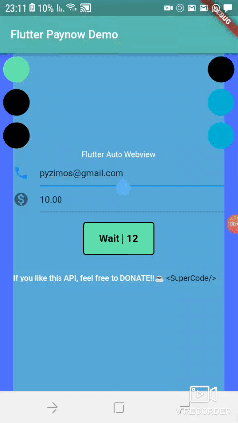

# paynow

This is an unofficial flutter package for [Paynow](https://paynow.co.zw)



## Getting Started

```
Paynow paynow = Paynow(integrationKey: "XXXXXXXXXXXXXXXXXXXXX", integrationId: "XXXX", returnUrl: "http://google.com", resultUrl: "http://google.com");
Payment payment = paynow.createPayment("user", "user@email.com");

payment.add("Banana", 1.9);


// Initiate Paynow Transaction and parse in application context
  paynow.send(payment, context)
  // wait for webview to open


```
Using this method requires that you cross check your ```resultUrl``` and ```returnUrl``` are correct as an error might inconvenience your users.

A webview will be lauched when the redirect link from paynow is ready after calling ```paynow.send```. The package [webview_flutter](https://pub.dev?q=webview_flutter)


## For iOS  
To use this plugin on iOS you need to opt-in for the embedded views preview by adding a boolean property to the app's Info.plist file, with the key io.flutter.embedded_views_preview and the value YES.


All contributions and PRs are welcome :) AND don't be shy to open issues.


[SuperCode](https://ignertic.github.io)
